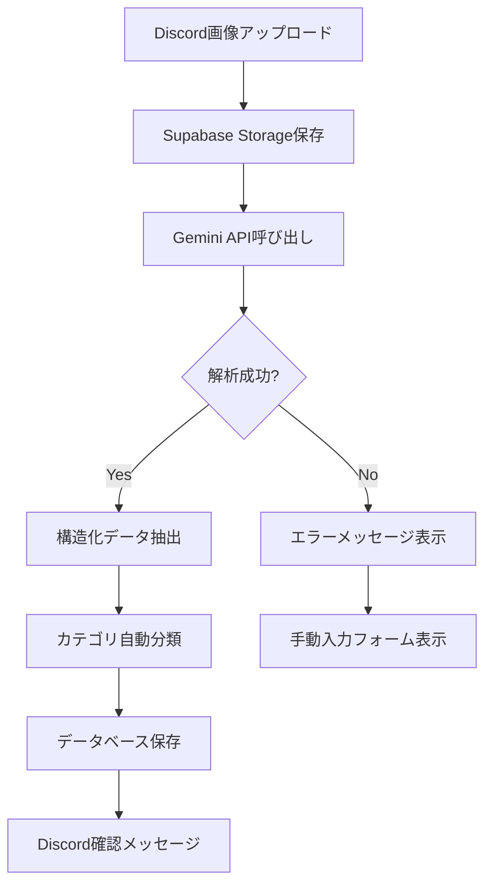

# OCR 処理設計

## Gemini API を使用したレシート解析

### 概要
Google Gemini API の画像理解機能を使用してレシートの内容を解析する。

### 実装方針

1. **画像の前処理**
   - Discord からアップロードされた画像を Supabase Storage に保存
   - 大きすぎる画像は適切なサイズにリサイズ
   - JPEG/PNG 形式をサポート

2. **Gemini API プロンプト設計**
   ```typescript
   const prompt = `
   このレシート画像から以下の情報を抽出してください：
   
   1. 店舗名
   2. 合計金額（税込）
   3. 税額（わかる場合）
   4. 日付（YYYY-MM-DD形式）
   5. 主な購入品目（最大5つ）
   
   JSON形式で回答してください：
   {
     "storeName": "店舗名",
     "totalAmount": 1234,
     "taxAmount": 123,
     "date": "2024-01-01",
     "items": ["商品1", "商品2"],
     "confidence": 0.95
   }
   `;
   ```

3. **エラーハンドリング**
   - 画像が不鮮明な場合の再アップロード要求
   - 部分的な情報抽出でも保存
   - 手動修正機能の提供

### 処理フロー



### カテゴリ自動分類ロジック

1. **キーワードマッチング**
   - 店舗名からカテゴリを推定
   - 購入品目から補助的に判断

2. **AI による分類**
   ```typescript
   const categoryPrompt = `
   以下のレシート情報から最も適切な経費科目を選んでください：
   
   店舗名: ${storeName}
   購入品目: ${items.join(', ')}
   
   選択肢:
   - SUPPLIES: 消耗品費（事務用品、10万円未満の物品）
   - TRAVEL: 旅費交通費（電車、バス、タクシー）
   - MEETING: 会議費（会議の飲食代）
   - ENTERTAINMENT: 交際費（接待、贈答品）
   - BOOKS: 新聞図書費（書籍、雑誌）
   - COMMUNICATION: 通信費（電話、インターネット）
   - UTILITIES: 水道光熱費（電気、ガス、水道）
   - COMMISSION: 支払手数料（振込手数料等）
   - MISC: 雑費（その他少額経費）
   
   回答形式:
   {
     "category": "SUPPLIES",
     "confidence": 0.85,
     "reason": "文房具店での購入のため"
   }
   `;
   ```

3. **学習機能**
   - ユーザーの修正履歴を記録
   - 同じ店舗の次回分類に活用

### セキュリティ考慮事項

1. **API キー管理**
   - 環境変数での管理
   - キーのローテーション

2. **レート制限**
   - Gemini API の制限に対応
   - キューイングシステムの実装

3. **プライバシー**
   - 個人情報のマスキング
   - データ保持期間の設定